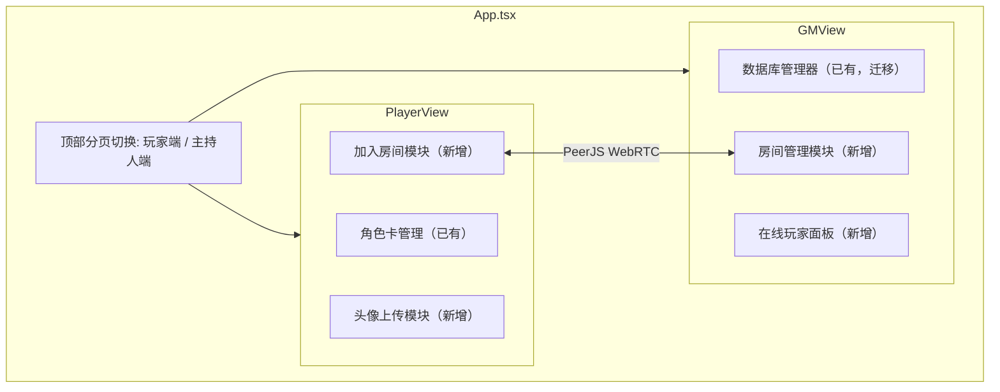
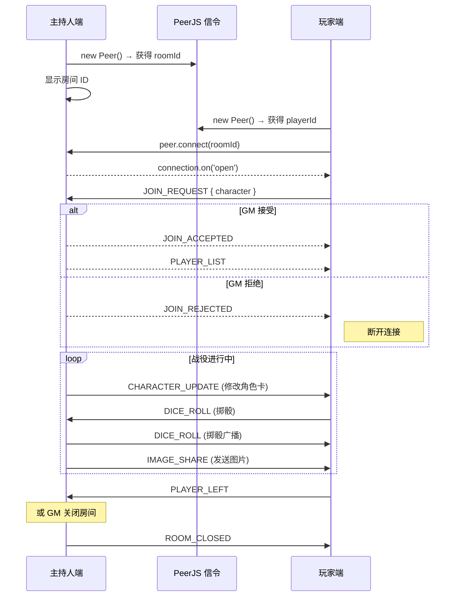

# 不咕鸟 DND5R 制卡器 — 玩家端/主持人端 拆分需求文档

> **版本**: v1.0 草案
> **日期**: 2026-03-10（已确认设计决策）
> **项目**: `DND5R-easy-cc`（Vite + React 18 + TypeScript）

---

## 一、整体目标

将现有的单页制卡工具拆分为**两个顶层分页**：

| 分页                         | 目标用户 | 核心功能                              |
| ---------------------------- | -------- | ------------------------------------- |
| **🎭 玩家端**          | 玩家     | 角色卡创建/管理 + 头像上传 + 加入房间 |
| **🛡️ 主持人端 (GM)** | 地下城主 | 数据库管理 + 建立/管理联机房间        |

两端通过 **PeerJS**（公共免费信令服务器 `0.peerjs.com`）实现 WebRTC P2P 实时联机，主持人端作为 Host，玩家端作为 Client。

### 已确认设计决策

| # | 决策项              | 结论                                      |
| - | ------------------- | ----------------------------------------- |
| 1 | 顶层 Tab 切换持久化 | ✅ 使用 localStorage 记住上次选择的标签页 |
| 2 | 玩家加入房间审核    | ✅ GM 需手动 Accept/Reject                |
| 3 | PeerJS 信令服务器   | ✅ 使用公共免费服务器 `0.peerjs.com`    |

---

## 二、架构概览



---

## 三、玩家端详细需求

### 3.1 侧边栏精简

将现有 `Sidebar.tsx` 的菜单精简为玩家端专属内容：

| 菜单项       | 说明                                         |
| ------------ | -------------------------------------------- |
| 📋 角色卡    | 进入角色卡管理/编辑（已有 `sheet` 模块）   |
| 🔥 法术书    | 法术管理（已有 `spellbook` 模块）          |
| ─ 分割线 ─ |                                              |
| 🚪 加入房间  | 输入房间 ID 加入主持人战役（**新增**） |

**移除项目**：所有 `lib-*` 数据库管理入口移至主持人端。

### 3.2 角色卡头像上传功能（新增）

#### 3.2.1 功能描述

- 在角色卡信息页（`TabHome` 或 `StepIdentity`）新增一个**圆形头像区域**
- 用户点击头像区域可触发文件选择器，选择本地图片
- 支持格式：`.jpg`、`.png`、`.webp`，大小限制 **2MB**
- 图片经前端压缩/裁剪后以 **Base64 Data URL** 存入 `CharacterData`

#### 3.2.2 技术实现

**类型扩展**（`types.ts`）：

```diff
export interface CharacterData {
  id: string;
+ avatarDataUrl: string;  // Base64 头像图片，空字串代表无头像
  name: string;
  // ...
}
```

**组件实现**（新建 `components/AvatarUploader.tsx`）：

```
功能流程：
1. 渲染圆形占位区（无头像时显示默认图标）
2. 点击 → 触发 <input type="file" accept="image/*" />
3. FileReader 读取为 Data URL
4. Canvas 等比缩放到 200x200 像素 → 压缩为 JPEG（quality=0.8）
5. 输出 Base64 字符串 → 回调 onChange(dataUrl)
6. 父组件调用 updateCharacter({ avatarDataUrl: dataUrl })
```

**存储注意**：

- Base64 图片会存入 localStorage，需控制大小
- 压缩后单张头像约 **20-50KB**
- 可在 `useLocalStorage` 中加入容量溢出保护

#### 3.2.3 UI 设计

```
┌──────────────────────────────┐
│   ┌───────────┐              │
│   │  (头像)   │  角色名称     │
│   │  圆形     │  职业 / 等级  │
│   │  点击上传  │  种族 / 背景  │
│   └───────────┘              │
│  [📷 上传头像] [🗑️ 移除头像]  │
└──────────────────────────────┘
```

### 3.3 加入房间功能（新增）

#### 3.3.1 功能描述

玩家可输入主持人发布的 **房间 ID** 加入联机战役。加入后：

- 需从本地角色卡列表中**选择一张角色卡**进场
- 角色卡数据（含头像）将发送给主持人端
- 主持人对角色卡的修改会实时同步回玩家端

#### 3.3.2 UI 流程

```
[加入房间] 页面：
  ┌──────────────────────────────────┐
  │  🚪 加入战役房间                  │
  │                                  │
  │  房间 ID: [________________]     │
  │  选择角色: [下拉选择角色卡]       │
  │                                  │
  │       [✅ 加入房间]               │
  └──────────────────────────────────┘

请求发送后，等待 GM 审核：
  ┌──────────────────────────────────┐
  │  ⏳ 等待主持人审核...             │
  │  角色: 某某某 (Lv5 战士)         │
  │       [❌ 取消请求]               │
  └──────────────────────────────────┘

GM 接受后，切换为在线状态面板：
  ┌──────────────────────────────────┐
  │  ✅ 已连接到房间: ROOM-XXXX      │
  │  当前角色: 某某某 (Lv5 战士)     │
  │  主持人: 在线                    │
  │                                  │
  │  ── 实时能力 ──                  │
  │  [🎲 掷骰] [🖼️ 查看共享图片]    │
  │                                  │
  │  ── 角色卡状态（只读） ──         │
  │  HP: 45/52  临时HP: 5            │
  │  (角色卡由 GM 实时同步修改)       │
  │                                  │
  │       [🚪 离开房间]               │
  └──────────────────────────────────┘
```

---

## 四、主持人端 (GM) 详细需求

### 4.1 侧边栏

将现有数据库管理类菜单全部归入主持人端：

| 菜单项       | 说明                                |
| ------------ | ----------------------------------- |
| 🏰 房间管理  | 创建/管理联机房间（**新增**） |
| ─ 分割线 ─ |                                     |
| 🛡️ 职业库  | 已有 `lib-class`                  |
| ⭐ 子职业库  | 已有 `lib-subclass`               |
| 👑 种族库    | 已有 `lib-species`                |
| 📜 背景库    | 已有 `lib-bg`                     |
| 📖 专长库    | 已有 `lib-feat`                   |
| ⚡ 法术库    | 已有 `lib-spell`                  |
| ─ 分割线 ─ |                                     |
| ⚔️ 武器库  | 已有 `lib-weapon`                 |
| 🛡️ 护甲库  | 已有 `lib-armor`                  |
| 🔨 工具库    | 已有 `lib-tool`                   |
| 🎒 冒险物品  | 已有 `lib-gear`                   |
| 🧪 魔法物品  | 已有 `lib-magic`                  |

### 4.2 房间管理模块（新增 · 核心功能）

#### 4.2.1 创建房间

```
[房间管理] 页面（无房间时）：
  ┌──────────────────────────────────┐
  │  🏰 战役房间                      │
  │                                  │
  │  房间名称: [________________]     │
  │                                  │
  │       [🚀 创建房间]               │
  └──────────────────────────────────┘
```

- 点击「创建房间」后：
  1. 初始化 PeerJS `Peer` 实例，生成唯一 Peer ID 作为房间 ID
  2. 显示房间 ID（可一键复制）供玩家加入
  3. 进入房间管理主界面

#### 4.2.2 房间主界面

```
  ┌──────────────────────────────────────────────────┐
  │  🏰 战役房间: "勇者的征途"                         │
  │  房间 ID: ROOM-a1b2c3  [📋 复制]                  │
  │  状态: 🟢 运行中   在线玩家: 3/8                   │
  │                                                   │
  │  ┌─ 待审核请求 ──────────────────────────────┐   │
  │  │  🆕 "勇者A" 请求加入 (Lv3 牧师)           │   │
  │  │       [✅ 接受]  [❌ 拒绝]                 │   │
  │  └────────────────────────────────────────────┘   │
  │                                                   │
  │  ┌─ 在线玩家列表 ─────────────────────────────┐   │
  │  │                                            │   │
  │  │  [头像] 阿拉贡 (Lv8 游侠)     [📝 编辑]   │   │
  │  │  [头像] 甘道夫 (Lv15 法师)     [📝 编辑]   │   │
  │  │  [头像] 金雳   (Lv7 战士)      [📝 编辑]   │   │
  │  │                                            │   │
  │  └────────────────────────────────────────────┘   │
  │                                                   │
  │  ── GM 工具栏 ──                                  │
  │  [🎲 全体掷骰] [🖼️ 发送图片] [🔄 同步更新]       │
  │                                                   │
  │       [🛑 关闭房间]                                │
  └──────────────────────────────────────────────────┘
```

#### 4.2.3 GM 编辑玩家角色卡

- 点击「编辑」按钮后，打开**与现有一致的角色卡编辑界面**
- GM 修改后的数据通过 PeerJS 通道实时推送给对应玩家客户端
- 玩家端收到后自动更新本地角色卡

#### 4.2.4 预设交互功能（**非文字聊天**）

房间内**没有文字聊天**，只提供以下预设功能：

| 功能          | 发起方    | 描述                                                        |
| ------------- | --------- | ----------------------------------------------------------- |
| 🎲 掷骰       | GM 或玩家 | 选择骰子类型（d4/d6/d8/d10/d12/d20/d100），发送结果给所有人 |
| 🖼️ 发送图片 | 仅 GM     | GM 选择本地图片，推送给所有已连接的玩家展示                 |
| 🔄 同步更新   | 自动      | GM 修改角色卡后自动同步，无需手动触发                       |

---

## 五、PeerJS 联机技术方案

### 5.1 技术选型

- **PeerJS** (`peerjs` npm 包)：封装了 WebRTC DataConnection
- 使用 PeerJS 公共信令服务器（或可配置自建）
- 纯前端 P2P，无需后端服务器

### 5.2 通信协议设计

所有 PeerJS 消息统一使用 JSON 信封格式：

```typescript
// types/room.ts

/** 消息类型枚举 */
type RoomMessageType =
  | 'JOIN_REQUEST'       // 玩家 → GM: 请求加入 + 角色卡数据
  | 'JOIN_ACCEPTED'      // GM → 玩家: 接受加入
  | 'JOIN_REJECTED'      // GM → 玩家: 拒绝加入
  | 'PLAYER_LIST'        // GM → 全体: 当前玩家列表快照
  | 'CHARACTER_UPDATE'   // GM → 玩家: GM 修改角色卡后推送
  | 'DICE_ROLL'          // 双向: 掷骰结果广播
  | 'IMAGE_SHARE'        // GM → 全体: 共享图片(Base64)
  | 'PLAYER_LEFT'        // 玩家 → GM: 离开通知
  | 'ROOM_CLOSED';       // GM → 全体: 房间关闭通知

/** 消息信封 */
interface RoomMessage {
  type: RoomMessageType;
  senderId: string;       // 发送者 Peer ID
  senderName: string;     // 显示名称
  timestamp: number;
  payload: any;           // 具体数据，根据 type 不同而不同
}

/** 掷骰请求/结果 payload */
interface DiceRollPayload {
  diceType: 'd4' | 'd6' | 'd8' | 'd10' | 'd12' | 'd20' | 'd100';
  count: number;          // 骰子数量
  results: number[];      // 每颗骰子结果
  total: number;          // 总和
  rollerName: string;     // 投掷者名称
}

/** 图片共享 payload */
interface ImageSharePayload {
  imageDataUrl: string;   // Base64 图片
  caption?: string;       // 可选标题
}

/** 加入房间请求 payload */
interface JoinRequestPayload {
  character: CharacterData;  // 完整角色卡数据(含头像)
}
```

### 5.3 连接生命周期



### 5.4 核心 Hooks / 模块

| 文件路径                       | 功能                                                   |
| ------------------------------ | ------------------------------------------------------ |
| `hooks/usePeerHost.ts`       | GM 视角：创建 Peer、管理连接池、广播消息、接收玩家消息 |
| `hooks/usePeerClient.ts`     | 玩家视角：连接到 Host、发送消息、接收 GM 推送          |
| `types/room.ts`              | 上述所有消息类型定义                                   |
| `components/RoomHost.tsx`    | GM 房间管理 UI                                         |
| `components/RoomJoin.tsx`    | 玩家加入房间 UI                                        |
| `components/DiceRoller.tsx`  | 掷骰 UI 组件（双端复用）                               |
| `components/ImageViewer.tsx` | 图片查看弹窗（玩家端接收 GM 共享的图片）               |

### 5.5 状态管理

新增 `contexts/RoomContext.tsx`：

```typescript
interface RoomState {
  // 通用
  isConnected: boolean;
  roomId: string | null;
  role: 'host' | 'client' | null;

  // GM 专属
  connectedPlayers: {
    peerId: string;
    playerName: string;
    character: CharacterData;
  }[];

  // 玩家专属
  selectedCharacterId: string | null;

  // 共享事件流
  diceHistory: DiceRollPayload[];
  sharedImages: ImageSharePayload[];
}
```

---

## 六、新增文件清单与修改一览

### 6.1 新增文件

| 文件                              | 说明               |
| --------------------------------- | ------------------ |
| `types/room.ts`                 | 房间消息类型定义   |
| `contexts/RoomContext.tsx`      | 房间状态管理       |
| `hooks/usePeerHost.ts`          | GM 端 PeerJS 逻辑  |
| `hooks/usePeerClient.ts`        | 玩家端 PeerJS 逻辑 |
| `components/PlayerView.tsx`     | 玩家端顶层视图     |
| `components/GMView.tsx`         | 主持人端顶层视图   |
| `components/PlayerSidebar.tsx`  | 玩家端精简侧边栏   |
| `components/GMSidebar.tsx`      | 主持人端侧边栏     |
| `components/RoomHost.tsx`       | GM 房间管理页面    |
| `components/RoomJoin.tsx`       | 玩家加入房间页面   |
| `components/AvatarUploader.tsx` | 头像上传组件       |
| `components/DiceRoller.tsx`     | 掷骰组件           |
| `components/ImageViewer.tsx`    | 图片查看弹窗       |

### 6.2 修改文件

| 文件                              | 修改内容                                             |
| --------------------------------- | ---------------------------------------------------- |
| `types.ts`                      | `CharacterData` 新增 `avatarDataUrl` 字段        |
| `App.tsx`                       | 顶层加入分页切换 + RoomProvider                      |
| `contexts/AppProviders.tsx`     | 包裹 `RoomProvider`                                |
| `contexts/CharacterContext.tsx` | `INITIAL_CHARACTER` 新增默认 `avatarDataUrl: ''` |
| `components/MainLayout.tsx`     | 拆分渲染逻辑，分流到 `PlayerView` / `GMView`     |
| `components/TabHome.tsx`        | 集成 `AvatarUploader`                              |
| `package.json`                  | 新增 `peerjs` 依赖                                 |

---

## 七、实操步骤（开发顺序）

### 阶段一：基础架构搭建

1. **安装依赖**

   ```bash
   npm install peerjs
   npm install -D @types/peerjs  # 如有类型定义包
   ```
2. **创建类型定义** `types/room.ts`

   - 定义 `RoomMessageType`、`RoomMessage`、`DiceRollPayload`、`ImageSharePayload`、`JoinRequestPayload`
3. **扩展 `CharacterData`**

   - 在 `types.ts` 中添加 `avatarDataUrl: string`
   - 在 `CharacterContext.tsx` 的 `INITIAL_CHARACTER` 中添加默认值
4. **创建顶层分页切换**

   - 修改 `App.tsx`，添加分页状态 `activeTab: 'player' | 'gm'`
   - 创建顶部 Tab 切换 UI（龙与地下城风格设计）
   - 根据 tab 渲染 `<PlayerView />` 或 `<GMView />`

### 阶段二：玩家端实现

5. **创建 `PlayerSidebar.tsx`**

   - 从现有 `Sidebar.tsx` 精简，仅保留：角色卡、法术书、加入房间
6. **创建 `PlayerView.tsx`**

   - 复用现有 `MainLayout` 中角色卡管理相关的渲染逻辑
   - 使用 `PlayerSidebar`
7. **实现 `AvatarUploader.tsx`**

   - 文件选择 → FileReader → Canvas 压缩 → Base64 输出
   - 集成到 `TabHome.tsx`（角色卡信息首页）
8. **实现 `RoomJoin.tsx`**

   - 加入房间表单 UI
   - 连接成功后的在线状态面板

### 阶段三：主持人端实现

9. **创建 `GMSidebar.tsx`**

   - 将所有 `lib-*` 菜单项迁移至此 + 新增「房间管理」
10. **创建 `GMView.tsx`**

    - 复用现有 `MainLayout` 中数据库管理相关的渲染逻辑
    - 集成房间管理模块
11. **实现 `RoomHost.tsx`**

    - 创建房间界面
    - 在线玩家列表
    - GM 工具栏（掷骰、发送图片）

### 阶段四：PeerJS 联机核心

12. **实现 `hooks/usePeerHost.ts`**

    - 初始化 Peer 实例
    - 监听连接 → 管理连接池
    - 广播消息到所有玩家
    - 接收 JOIN_REQUEST → 发送 JOIN_ACCEPTED / PLAYER_LIST
    - 修改角色卡后 → 发送 CHARACTER_UPDATE
13. **实现 `hooks/usePeerClient.ts`**

    - 初始化 Peer → 连接到 Host
    - 发送 JOIN_REQUEST（携带角色卡）
    - 接收 CHARACTER_UPDATE → 更新本地角色卡
    - 接收 IMAGE_SHARE → 打开 ImageViewer
    - 接收 DICE_ROLL → 显示掷骰结果
14. **创建 `contexts/RoomContext.tsx`**

    - 封装 Host/Client hooks
    - 提供统一的房间状态给 UI 组件

### 阶段五：交互功能

15. **实现 `DiceRoller.tsx`**

    - 骰子类型选择面板（d4 ~ d100）
    - 支持多骰投掷
    - 掷骰动画 + 结果展示
    - 通过 RoomContext 广播结果
16. **实现 `ImageViewer.tsx`**

    - 弹窗式图片展示
    - 支持缩放和关闭
    - GM 端：选择图片并发送
    - 玩家端：接收并弹出展示

### 阶段六：集成与测试

17. **集成测试**
    - 在同一浏览器开两个标签页测试 P2P 连接
    - 测试掷骰广播、图片发送、角色卡同步
    - 测试断线/重连/关闭房间等边界情况

---

## 八、关键技术注意事项

### 8.1 PeerJS 注意事项

- **公网信令服务器**: 使用 PeerJS 默认公共服务器 `0.peerjs.com`（免费，未来可迁移到自建）
- **ICE/TURN 穿透**: 部分网络环境下 WebRTC 直连失败，需配置 TURN 服务器（如 `coturn`）
- **Peer ID 格式**: 建议使用 `dnd5r-{随机短码}` 格式，人类可读
- **连接池管理**: GM 端需要维护一个 `Map<peerId, DataConnection>` 来管理所有玩家连接

### 8.2 Base64 图片存储

- localStorage 容量约 **5-10MB**，需要注意头像图片占用空间
- 头像压缩到 200x200 + JPEG 0.8 质量，单张约 20-50KB
- 角色卡通过 PeerJS 传输时包含头像，注意单次消息大小限制

### 8.3 玩家角色卡同步机制

- **GM 是权威源**: GM 修改后推送 CHARACTER_UPDATE，玩家端覆盖本地数据
- **冲突策略**: GM 端修改以 GM 为准，玩家端在房间内对角色卡的修改被忽略（只读模式）
- **离线回退**: 玩家断线后仍保留最后同步的角色卡副本

### 8.4 加入审核流程

- 玩家发送 `JOIN_REQUEST` 后进入等待状态
- GM 端弹出审核提示，显示玩家名和角色卡摘要
- GM 点击 Accept → 发送 `JOIN_ACCEPTED` + `PLAYER_LIST`
- GM 点击 Reject → 发送 `JOIN_REJECTED`，玩家端弹出提示并断开连接
- 等待超时：60 秒无响应则玩家端自动取消请求

### 8.5 安全与边界

- 房间最大人数建议限制为 **8 人**（WebRTC 连接数限制）
- GM 端对加入请求**必须**进行人工确认（Accept/Reject）
- 消息体大小限制：图片建议压缩至 **1MB 以下**
- PeerJS 连接心跳：每 30 秒 ping/pong 检测连接状态

---

## 九、非功能需求

| 项目               | 要求                                             |
| ------------------ | ------------------------------------------------ |
| **兼容性**   | Chrome 90+、Edge 90+、Firefox 88+（WebRTC 必需） |
| **响应式**   | 移动端仍可使用（侧边栏已有抽屉式支持）           |
| **本地化**   | 所有 UI 文案使用中文                             |
| **性能**     | 头像图片压缩后上传，PeerJS 消息避免频繁大包传输  |
| **离线能力** | 角色卡管理离线可用，联机功能需要网络             |
